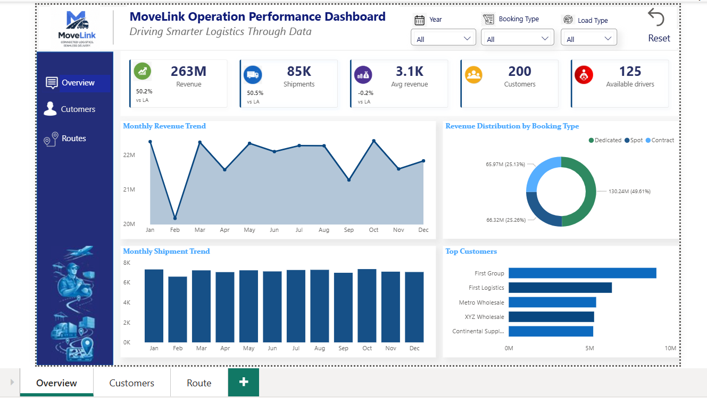
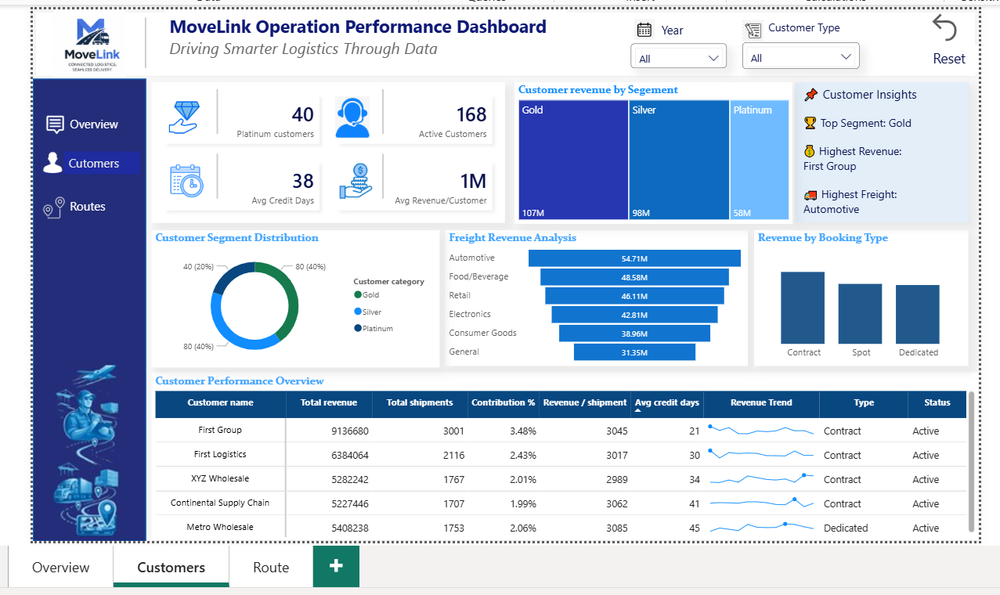
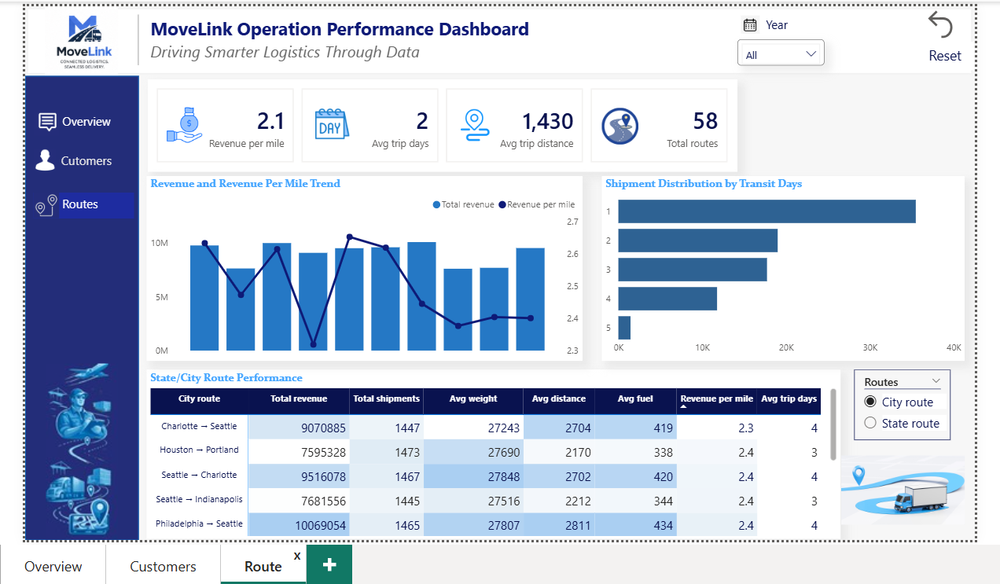

# 🚚 MoveLink Logistics Operations Dashboard

An end-to-end Business Intelligence project that analyzes logistics operations using SQL and Power BI. The dashboard provides interactive insights into revenue, shipments, customer performance, and route efficiency to support data-driven operational decision-making.

---

## 📌 Project Overview

The logistics industry generates large volumes of operational data every day. This project transforms raw logistics data into meaningful business insights by designing a SQL database, performing data cleaning, creating analytical views, and building an interactive Power BI dashboard.

The dashboard helps stakeholders monitor business performance, identify high-value customers, evaluate route efficiency, and track key operational KPIs.

---

## 🎯 Business Objectives

- Monitor overall logistics performance
- Analyze revenue and shipment trends
- Identify high-value customer segments
- Evaluate route efficiency and profitability
- Build an interactive executive dashboard for business users

---

## 🛠️ Tools & Technologies

- SQL Server Management Studio (SSMS)
- Microsoft SQL Server
- Power BI Desktop
- DAX (Data Analysis Expressions)
- Power Query
- Microsoft Excel

---

## 📂 Database Design

The project uses a relational database consisting of the following tables:

- Customer
- Load
- Trip
- Route
- Driver
- Truck

Additionally, SQL Views were created to simplify reporting and improve dashboard performance.

---

## 📊 Dashboard Pages

### 1️⃣ Executive Overview

Provides a high-level business summary including:

- Total Revenue
- Total Shipments
- Revenue per Shipment
- Revenue per Mile
- Year-over-Year (YoY) Growth
- Monthly Revenue Trend
- Monthly Shipment Trend
- Top Customers
- Revenue by Booking Type

---

### 2️⃣ Customer Analytics

Focuses on customer behavior and segmentation.

Key insights include:

- Active Customers
- Platinum Customers
- Average Revenue per Customer
- Customer Segmentation
- Revenue by Customer Type
- Revenue by Booking Type
- Freight Category Analysis
- Top Customer Performance Matrix

---

### 3️⃣ Route Analytics

Provides operational insights for transportation routes.

Includes:

- Revenue per Mile
- Average Trip Distance
- Average Trip Duration
- Route Performance Matrix
- Revenue Trend
- Shipment Trend

---

## 📈 Key Performance Indicators (KPIs)

- Total Revenue
- Total Shipments
- Revenue per Shipment
- Revenue per Mile
- Active Customers
- Platinum Customers
- Average Revenue per Customer
- Average Credit Period
- Total Routes
- Average Trip Distance
- Average Trip Days

---

## ⚙️ SQL Work Performed

- Database Design
- Primary & Foreign Key Relationships
- Data Cleaning
- Null Value Handling
- SQL Views
- Business Analysis Queries
- Data Validation

---

## 📊 Power BI Features

- Data Modeling
- Star Schema Relationships
- Date Table
- DAX Measures
- Time Intelligence (YoY)
- Interactive Slicers
- Drill-through Navigation
- Dynamic KPI Cards
- Custom Navigation Buttons

---

## 📸 Dashboard Preview

### Executive Overview



---

## Customer Analytics



---

### Route Analytics



---

## 📁 Repository Structure

```
MoveLink-Logistics-Dashboard
│
├── Dashboard
│   └── MoveLink Logistics Dashboard.pbix
│
├── SQL
│   ├── 01_Database_Schema.sql
│   ├── 02_Data_Cleaning.sql
│   ├── 03_SQL_Views.sql
│   └── 04_Business_Analysis_Queries.sql
│
├── Dashboard Images
│
├── Dataset
│
└── README.md
```

---

## 💡 Key Business Insights

- Revenue trends can be monitored across different years.
- Customer segmentation identifies high-value customers.
- Booking type analysis highlights business distribution.
- Route analysis helps identify operational efficiency.
- Interactive filters allow detailed business exploration.

---

## 🚀 Future Enhancements

- Driver Performance Dashboard
- Fleet Utilization Analysis
- Predictive Demand Forecasting
- Fuel Cost Optimization
- Real-time Data Integration

---

## 👩‍💻 About Me

**Vidhi Agrawal**

MBA (Business Analytics)

Aspiring Data Analyst | SQL | Power BI | Excel | Python

LinkedIn: *(Add your LinkedIn URL)*

GitHub: *(Add your GitHub Profile URL)*

Email: *(Optional)*

---

## ⭐ If you found this project useful, please consider giving it a star!
